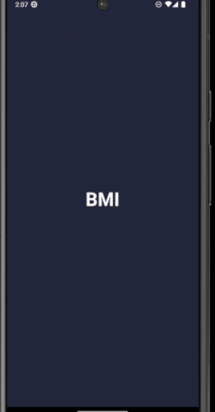

# BMI Calculator 🧮

A Flutter-based BMI (Body Mass Index) calculator app with a clean user interface. Users can:

- Select gender (Male/Female)
- Adjust height using a slider
- Set weight and age with increment/decrement buttons
- Calculate BMI instantly
- Receive a health interpretation (e.g., Normal, Overweight)

## 🚀 Technologies
- Flutter
- Dart
- Material Design

## 📷 Demo

## 📦 Getting Started
1. Clone the repo
2. Run `flutter pub get`
3. Run on emulator or device: `flutter run`

---

Let me know if you want to deploy it to Android/iOS or publish it to the Play Store.
